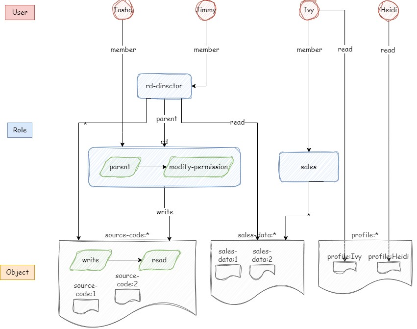

# Zanzibar semantic

## Reserved words

- All: @ # ( ) :
- Relatoion: "member" "parent"
- Namespace: "role", "user"

## Domain

No need to do anything because zanzibar is relation-tuple based.

## Relation

role:rd-director#member@user:Jimmy
role:rd#member@user:Tasha
role:sales#member@user:Ivy
role:rd#parent@role:rd-director

## Permission

profile:Ivy#read@user:Ivy
profile:Heidi#read@user:Heidi
source-code:*#*@role:rd-director
sales-data:*#read@role:rd-director
source-code:*#write@role:rd
sales-data:*#*@role:sales
sales-data:1#write@role:rd

## Link

role:rd#modify-permission@(role:rd#parent)
source-code:*#read(source-code:*write)

## Graph

